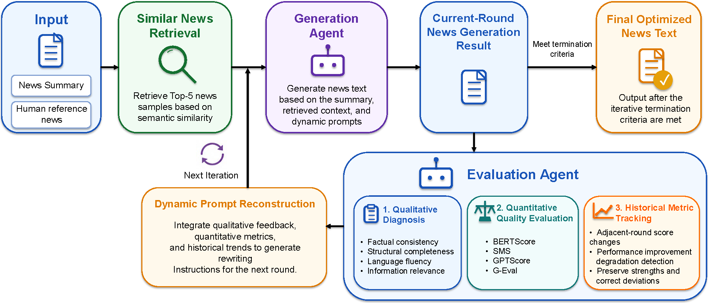

# NNB-Rewriter

<p align="center">

</p>

A **Self-Refine** news rewriting pipeline for the New News Broadcasting (NNB) system. It iteratively improves machine-generated news articles through LLM-based critique, metric-guided regeneration, and automatic quality-based rollback — all grounded strictly in the source summary.

## Overview

This project implements a closed-loop self-refine pipeline: each iteration evaluates the current draft (via LLM critique + multi-metric scoring), rewrites it with exemplar-guided prompts and per-news improvement suggestions, measures quality against human references. The pipeline runs 6 iterations by default, tracking per-article metrics across rounds.

It also provides a one-shot news generator that produces a full article from a user-provided summary, using top‑5 similar exemplars retrieved from the dataset.

## Pipeline

<p align="center">

</p>

1. **Evaluation** — LLM (Qwen3.5-9B) generates targeted critique for the current draft of each article.
2. **Generation** — LLM rewrites the article guided by critique, per-news metric trends, exemplar articles, and word‑count targets.
3. **Metric Scoring** — BERTScore, SMS, GPTScore, and G‑Eval (3‑dim → 4‑dim mapping) are computed; per‑news metrics are stored.
4. **Rollback** — If the current rewrite scores lower than the previous version, it is rejected and the previous version is kept.

## Key Features

- **Self-Refine Loop** — 6‑iteration closed loop with evaluation → generation → scoring → rollback.
- **Top‑5 Similarity Retrieval** — Uses `SentenceTransformer` embeddings + cosine similarity to find the 5 most similar summaries as exemplars.
- **Dual LLM Backend** — Qwen client (port 8001) for evaluation & generation; Llama client (port 8000) available as alternative.
- **Multi‑Metric Evaluation** — BERTScore, SMS (Sentence Movers Similarity via Optimal Transport), GPTScore, and G‑Eval (consistency / coverage / quality, mapped to coherence–consistency–fluency–relevance).
- **Per‑News Tracking (v3)** — Metrics stored per `news_id` across iterations in `result/per_news_metrics.json`; legacy v1/v2 formats are auto‑migrated.
- **Personalized Improvement Suggestions** — Each rewrite prompt includes dimension‑specific hints derived from that article's metric trend (e.g. "Improve semantic similarity: reuse more vocabulary from the human news").
- **Quality‑Based Rollback** — Articles whose composite score drops are automatically reverted to the previous version.
- **Experiment Comparison** — `result/summarize_results.py` produces a summary table comparing self‑refine results against Qwen/Llama baselines.

## File Structure

```plaintext
NNB-Rewriter/
├── Rewriter.py                  # Main self-refine pipeline (6 iterations)
├── utils/
│   ├── prompt.py                # Prompt builders (evaluation & attacking/generation)
│   ├── evaluation.py            # BERTScore, SMS, GPTScore, G-Eval metrics
│   ├── per_news_evaluation.py   # Per-news metric storage (v3) & improvement suggestions
│   └── visualization.py         # Matplotlib plots (geval.png, overall.png)
├── dataset/
│   ├── cnn_dailymail.json       # Full dataset (1000 articles)
│   ├── dataset.py               # Generate machine_news for all articles via LLM
├── result/
│   ├── evaluation_result.json   # Per-iteration average metrics
│   ├── per_news_metrics.json    # Per-news metrics across iterations (v3 format)
│   ├── metrics.png              # Metric trend visualization
├── local_models/
│   ├── all-MiniLM-L6-v2/        # SentenceTransformer for similarity retrieval
│   └── paraphrase-MiniLM-L6-v2/ # SentenceTransformer for paraphrase tasks
├── requirements.txt
└── README.md
```

## Dependencies

```bash
pip install -r requirements.txt
```

## Configuration

### Required Environment Variables

```bash
export OPENAI_API_KEY="EMPTY"
export OPENAI_API_BASE="http://localhost:8001/v1"
```

### Optional Environment Variables

```bash
# Evaluation model
export EVAL_MODEL="Qwen3.5-9B"                      # default

# Generator model
export GEN_MODEL="Qwen3.5-9B"                      # default

# BERTScore batch size
export BERTSCORE_BATCH_SIZE=16                       # default
```

**Note:** `Rewriter.py` creates **two** OpenAI clients internally:
- `qwen_client` — points to `OPENAI_API_BASE` (default `http://localhost:8001/v1`), used for evaluation feedback, generation, and metric scoring.
- `llama_client` — points to `OPENAI_API_BASE` (default `http://localhost:8000/v1`), imported but evaluation/generation use the Qwen client by default.

## Preparing Local Models

The pipeline requires three models. Two (all-MiniLM-L6-v2, paraphrase-MiniLM-L6-v2) are loaded from `local_models/` by default; the third (bert-base-uncased, for BERTScore) and all-mpnet-base-v2 (for SMS) use **absolute paths** configurable in `utils/evaluation.py`.

### Models bundled in `local_models/`

- `all-MiniLM-L6-v2` — similarity retrieval (used by `prompt.py`)
- `paraphrase-MiniLM-L6-v2` — paraphrase tasks

### Models requiring external download

The following are referenced via **hardcoded absolute paths** in `utils/evaluation.py`:
- `bert-base-uncased` → `LOCAL_BERT_PATH = "/root/autodl-tmp/bert-base-uncased"`
- `all-mpnet-base-v2` → `LOCAL_SMS_MODEL_PATH = "/root/autodl-tmp/all-mpnet-base-v2"`

**Update these paths** in [utils/evaluation.py](utils/evaluation.py) before running.

Download from Hugging Face:

```python
from sentence_transformers import SentenceTransformer
from transformers import AutoModel, AutoTokenizer

# BERTScore model
model = AutoModel.from_pretrained("bert-base-uncased")
tokenizer = AutoTokenizer.from_pretrained("bert-base-uncased")
model.save_pretrained("local_models/bert-base-uncased")
tokenizer.save_pretrained("local_models/bert-base-uncased")

# SMS model
sms_model = SentenceTransformer("all-mpnet-base-v2")
sms_model.save("local_models/all-mpnet-base-v2")

# Similarity models (if not already present)
for name in ["all-MiniLM-L6-v2", "paraphrase-MiniLM-L6-v2"]:
    m = SentenceTransformer(name)
    m.save(f"local_models/{name}")
```

Or via ModelScope:

```bash
pip install modelscope
modelscope download --model google-bert/bert-base-uncased
modelscope download --model sentence-transformers/all-mpnet-base-v2
modelscope download --model sentence-transformers/all-MiniLM-L6-v2
modelscope download --model sentence-transformers/paraphrase-MiniLM-L6-v2
```

## Dataset Preparation

All datasets share the same JSON schema (array of objects):

```json
{
  "id": "...",
  "summary": "...",
  "human_news": "...",
  "machine_news": "...",
  "evaluation": "",
  "gpt_news": "",
  "pre_gpt_news": "",
  "similar": []
}
```

| Field | Description |
|-------|-------------|
| `id` | Unique article identifier |
| `summary` | Source news summary (facts only) |
| `human_news` | Human-written reference article |
| `machine_news` | Initial machine-generated article (baseline) |
| `evaluation` | LLM critique text (populated at runtime) |
| `gpt_news` | Current rewritten article (populated at runtime) |
| `pre_gpt_news` | Previous iteration's rewritten article |
| `similar` | Top‑5 similar article IDs (populated at runtime) |

### Dataset files

- `dataset/cnn_dailymail.json` — Full dataset (generated from [CNN/DailyMail](https://huggingface.co/datasets/abisee/cnn_dailymail) on Hugging Face).
- `dataset/cnn_dailymail_debug.json` — Small debug subset for quick testing.

### Generating machine_news

Run `dataset/dataset.py` to populate the `machine_news` field for all articles using the LLM:

```bash
python dataset/dataset.py
```

This reads `dataset/cnn_dailymail.json` and outputs `dataset/cnn_dailymail_updated.json`.

## Usage

```bash
python Rewriter.py
```

The pipeline:
1. Clears work fields in the raw dataset (`cnn_dailymail.json`).
2. Clones it to `dataset/rewrited_cnn_dailymail.json` as the working copy.
3. Precomputes top‑5 similar IDs for every article.
4. Runs 6 iterations of: **Evaluation** (LLM critique) → **Generation** (LLM rewrite with metric‑guided prompts) → **Metric Scoring** (BERTScore + SMS + GPTScore + G‑Eval) → **Rollback** (reject degraded rewrites).
5. Saves cleaned news texts to `result/news/news_{id}.txt`.

Parallelism: 4 workers for API calls; thread‑safe file I/O throughout.

The script:
- Retrieves top‑5 similar summaries from `dataset/rewrited_cnn_dailymail.json`.
- Uses their best available news as style exemplars.
- Calls the LLM to generate a full article grounded strictly in your summary.
- Saves output to `result/user_generated_news.txt`.

## Notes

- The **summary** and **human_news** are the ONLY factual sources. No new entities, numbers, dates, or quotes are allowed in generated text.
- Iterative rewriting always operates on a **working copy** (`rewrited_cnn_dailymail.json`) cloned from the raw source.
- Work fields (`evaluation`, `gpt_news`, `pre_gpt_news`, `similar`) are cleared before each run.
- The `bert-base-uncased` and `all-mpnet-base-v2` model paths are **hardcoded** in `utils/evaluation.py` — update them to match your environment.
- The similarity model path in `utils/prompt.py` is hardcoded to `/root/autodl-tmp/all-MiniLM-L6-v2` — update if needed.
- Set `TRANSFORMERS_OFFLINE=1` before running if you have all models downloaded locally.

## Contributors

- [lizhizhongpingguo](https://github.com/lizhizhongpingguo) — Top‑5 similarity function & ablation study
- [Yichan521](https://github.com/Yichan521) — Prompt logic optimization
